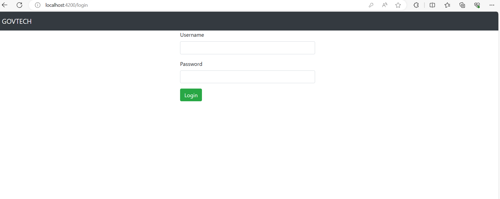
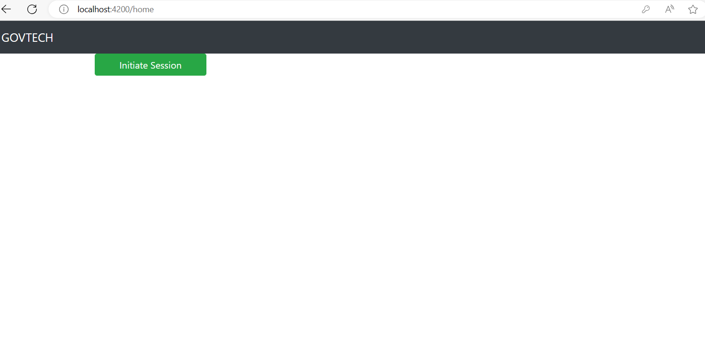
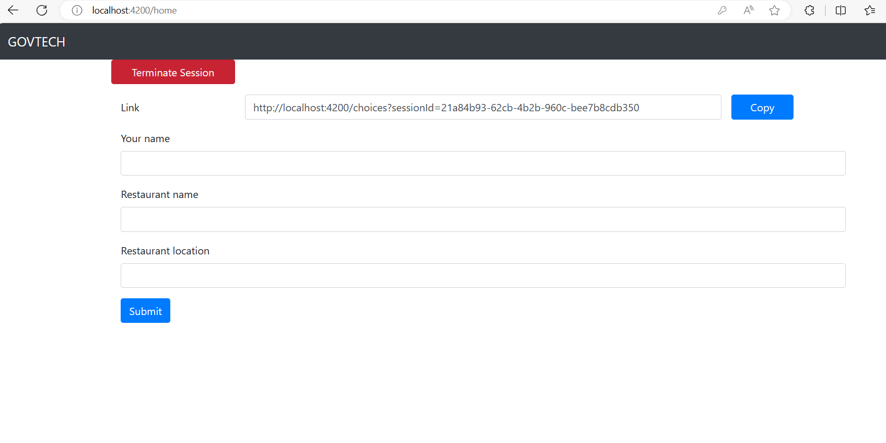
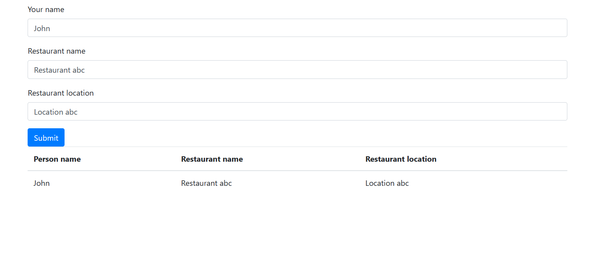
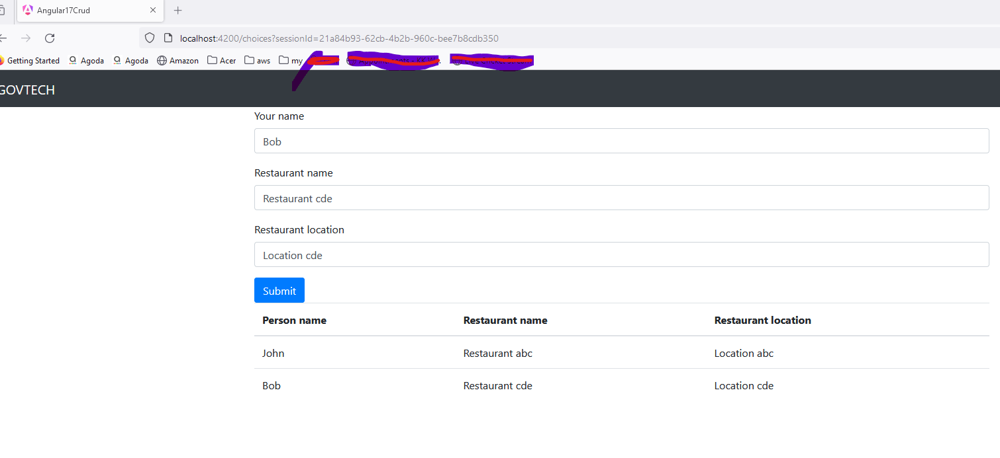

# Angular 17 application

This is an Angular 17 front end application which developed for the back end API: https://github.com/theprogzone/restaurant-decider.

## Overview

This application is a simple UI application for decide a restaurant for office teammates during their lunchtime. In this application one user can login to the system and initiate a session. With that sesion application generates a sharable url. Using this url, other team members can provide their preference by providing restaurant name, restaurant location and their name. Once all the team members have provided their preferences, session initiator can terminate the session. Then the application randomly select a restaurant and visualize it to everyone.

## How to Run

* '''Node js''' and '''npm''' should be installed before run the application.

- [Node.js](https://nodejs.org/)
- [npm](https://www.npmjs.com/)

* Clone the respository
* Go inside to the project root folder and install the '''npm''' packages described in the '''package.json''' using this command: '''npm install'''
* Run this command to up the dev server: '''ng serve --port 4200'''

Once the application runs successfully you should see something like this

'''
Initial Chunk Files | Names         |  Raw Size
scripts.js          | scripts       | 206.82 kB | 
styles.css          | styles        | 194.12 kB | 
polyfills.js        | polyfills     |  82.71 kB | 
main.js             | main          |  31.79 kB | 

                    | Initial Total | 515.44 kB

Application bundle generation complete. [1.522 seconds]
Watch mode enabled. Watching for file changes...
  ➜  Local:   http://localhost:4200/
'''

* After running the this application, we need to run the back end server as well. Instruction to run the back end server, you can find from this url: https://github.com/theprogzone/restaurant-decider

## How the application works

* Once you have ran the Angular application and back end application, type this url in your browser: http://localhost:4200/
* Then you will be redirected to the below page:

* Provide credentials as below and click the login button:

Username : '''admin'''
Password : '''admin1234'''

* Then you will be redirected to the below page:

* In this page, need to click the 'Initiate Session' button to start a session.
* Once you have initiated a session, you can see the session url in the page. This url you can share with the other users to submit their choice. Within this page you can submit your choice for the restaurant:

* Once you have submit your choice, you can see the below table:

* Using the link generated in the above page, other team members also can submit their preferences.

* Once all the team members have submit their preference, sesion initiator can terminate the session by clicking the Terminate Session button. Then application selects a restaurant randomly and display it in everyones pages:

